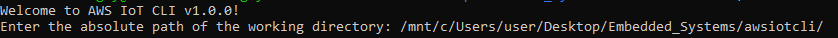
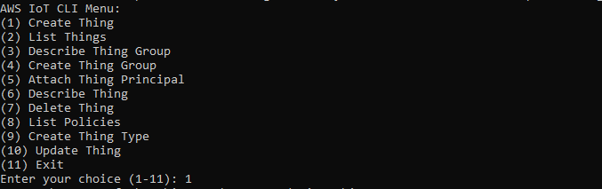
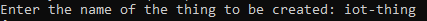
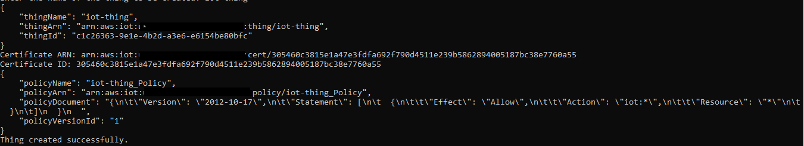
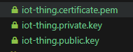

# AWS IoT CLI

This is a simple Command Line Interface (CLI) for interacting with the AWS IoT managed service on AWS. It allows you to create things, list things, and perform other operations related to the provisioning and management of IoT devices.

## Prerequisites

Before you begin, make sure you have the following installed on your system:

- [CMake](https://cmake.org/download/) (minimum version 3.5)
- [Ninja](https://ninja-build.org/) (or any other build system supported by CMake)
- C++ compiler with C++11 support

## Building and Running

Follow these steps to build and run the AWS IoT CLI:

1. **Clone the Repository:**

    ```bash
    git clone https://github.com/thathardwareguy/Aws-IoT-CLI.git
    cd awsiotcli
    ```

2. **Create a Build Directory:**

    ```bash
    mkdir build
    cd build
    ```

3. **Generate Build Files:**

    ```bash
    cmake -G Ninja ..
    ```

4. **Compile using Ninja:**

    ```bash
    ninja
    ```

5. **Run the AWS IoT CLI:**

    ```bash
    ./awsiotcli
    ```

    - **Git Bash:**
        - Install [Git for Windows](https://gitforwindows.org/)
        - Launch Git Bash from the Start menu
        - Follow the Linux instructions above

    - **Ubuntu for Windows:**
        - Install [Ubuntu for Windows](https://ubuntu.com/tutorials/ubuntu-on-windows#1-overview)
        - Launch Ubuntu from the Start menu
        - Follow the Linux instructions above

## Usage

Once the CLI is running, you will see a menu with options to perform various operations related to AWS IoT. Follow the on-screen prompts to interact with the CLI.

#### Example: Creating a Thing

1. **Enter the absolute path of the working directory:**
   In my case, the absolute working directory is in my Ubuntu for Windows Environment:

     ```bash
     /mnt/c/Users/user/Desktop/Embedded_Systems/awsiotcli/
     ```




The working directory is essential to ensure that the certificates generated are placed in the specified location of the user.

2. **Choose "Create Thing" (Option 1)**





3. **Enter the name of the thing to be created:**





Ensure that there is a `policy.json` file in the specified working directory. The `policy.json` file contains the access policies for the created IoT thing.

Once the device is successfully created, you will get an output similar to this below.





The specified directory should now contain the device certificates and keys.





## Contributing

If you'd like to contribute to this project, feel free to fork the repository and create a pull request.
